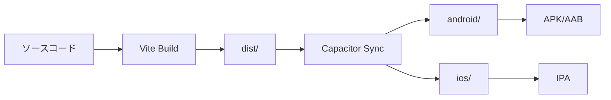
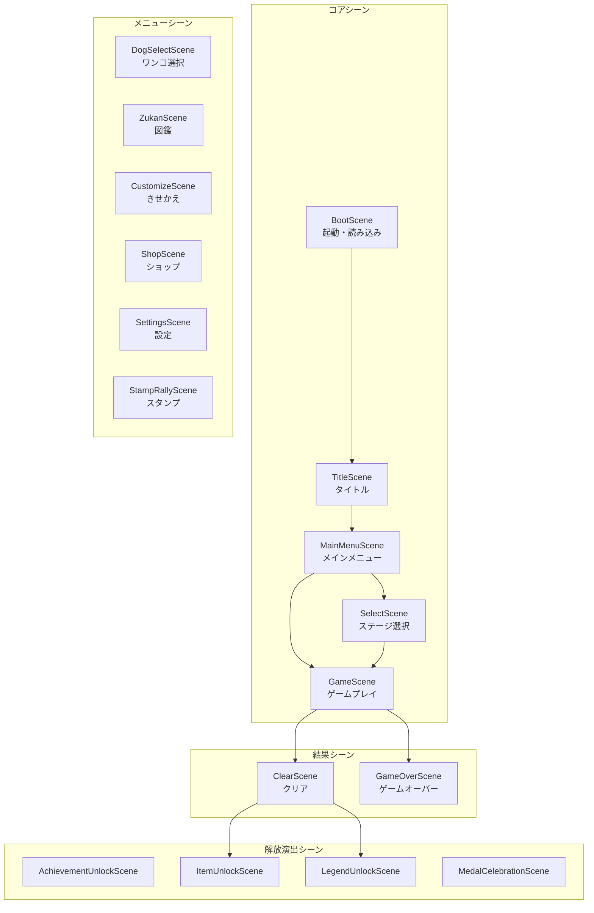

# ワンこねくと - 技術仕様書

> **バージョン**: 1.0.0  
> **最終更新**: 2026年1月  
> **対象読者**: 開発者、次回プロジェクト参照用

---

## 目次

1. [技術スタック](#1-技術スタック)
2. [プロジェクト構成](#2-プロジェクト構成)
3. [シーン管理アーキテクチャ](#3-シーン管理アーキテクチャ)
4. [データ永続化](#4-データ永続化)
5. [レベル生成アルゴリズム](#5-レベル生成アルゴリズム)
6. [オーディオシステム](#6-オーディオシステム)
7. [エフェクト・アニメーション](#7-エフェクトアニメーション)
8. [UI/UXデザインパターン](#8-uiuxデザインパターン)
9. [モバイル対応](#9-モバイル対応)
10. [プラグイン統合](#10-プラグイン統合)
11. [次回開発への推奨事項](#11-次回開発への推奨事項)

---

## 1. 技術スタック

### 1.1 フレームワーク・ライブラリ

| 技術 | バージョン | 用途 |
|------|-----------|------|
| **Phaser.js** | 3.80.1 | ゲームエンジン |
| **Vite** | 5.4.0 | ビルドツール |
| **Capacitor** | 6.0.0 | モバイルアプリ化 |
| **JavaScript** | ES2022+ | メイン言語（ES Modules） |

### 1.2 依存関係（package.json）

#### 本番依存関係

```json
{
  "dependencies": {
    "@capacitor-community/admob": "^6.2.0",
    "@capacitor/haptics": "^6.0.3",
    "@capgo/native-purchases": "^8.0.18",
    "phaser": "^3.80.1",
    "sharp": "^0.34.5"
  }
}
```

| パッケージ | 用途 |
|-----------|------|
| @capacitor-community/admob | Google AdMob広告 |
| @capacitor/haptics | 触覚フィードバック |
| @capgo/native-purchases | アプリ内課金（RevenueCat互換） |
| phaser | 2Dゲームエンジン |
| sharp | 画像処理（アセットリサイズ用） |

#### 開発依存関係

```json
{
  "devDependencies": {
    "@capacitor/android": "^6.0.0",
    "@capacitor/cli": "^6.0.0",
    "@capacitor/core": "^6.0.0",
    "@capacitor/ios": "^6.0.0",
    "@capacitor/status-bar": "^6.0.0",
    "gh-pages": "^6.3.0",
    "typescript": "^5.9.3",
    "vite": "^5.4.0"
  }
}
```

### 1.3 ビルドスクリプト

```json
{
  "scripts": {
    "dev": "vite",
    "build": "vite build",
    "build:gh-pages": "vite build --base=/inusanpo/",
    "preview": "vite preview",
    "cap:sync": "npx cap sync",
    "build:android": "npm run build && npx cap sync android",
    "build:ios": "npm run build && npx cap sync ios"
  }
}
```

---

## 2. プロジェクト構成

### 2.1 ディレクトリ構造

```
inusanpo/
├── game.js              # メインゲームロジック（15,355行）
├── main.js              # 旧実装（参照用）
├── index.html           # HTMLエントリーポイント
├── style.css            # スタイルシート
├── levelGenerator.js    # レベル生成アルゴリズム
├── generateLevels.js    # 500ステージ一括生成スクリプト
├── effects.js           # エフェクト定義（未統合）
├── AdManager.js         # 広告管理
├── PurchaseManager.js   # 課金管理
├── HapticManager.js     # 触覚フィードバック
├── vite.config.js       # Vite設定
├── capacitor.config.ts  # Capacitor設定
├── package.json         # 依存関係
│
├── assets/              # ゲームアセット
│   ├── audio/          # BGM・SE
│   ├── characters/     # キャラクター画像
│   │   ├── dog_XX_name/    # 通常犬種
│   │   └── legend_XX_name/ # 伝説犬種
│   ├── gazou/          # UI画像
│   └── kisekae/        # きせかえ画像
│
├── public/             # 静的アセット
├── dist/               # ビルド出力
├── android/            # Android プロジェクト
├── ios/                # iOS プロジェクト
├── scripts/            # ユーティリティスクリプト
└── docs/               # ドキュメント
```

### 2.2 ファイル役割詳細

| ファイル | 行数 | 役割 |
|----------|------|------|
| game.js | 15,355 | Phaser.jsゲーム全体、全シーン、ロジック |
| levelGenerator.js | ~200 | レベル自動生成アルゴリズム |
| AdManager.js | ~150 | AdMobインタースティシャル広告管理 |
| PurchaseManager.js | ~200 | アプリ内課金処理 |
| HapticManager.js | ~100 | Capacitor Haptics APIラッパー |
| effects.js | ~300 | Phaserエフェクト定義（未使用） |

### 2.3 ビルドフロー



### 2.4 Vite設定（vite.config.js）

```javascript
export default defineConfig({
  base: './',  // 相対パス（GitHub Pages用は '/inusanpo/'）
  
  server: {
    port: 5173,
    host: true,  // LAN公開
    open: true   // 自動ブラウザ起動
  },
  
  build: {
    outDir: 'dist',
    assetsInlineLimit: 4096,  // 4KB以下はインライン化
    sourcemap: false,
    rollupOptions: {
      output: {
        manualChunks: {
          phaser: ['phaser']  // Phaserを別チャンクに分離
        }
      }
    }
  },
  
  optimizeDeps: {
    include: ['phaser']  // Phaserを事前バンドル
  }
});
```

---

## 3. シーン管理アーキテクチャ

### 3.1 Phaser設定

```javascript
const config = {
    type: Phaser.AUTO,
    width: GAME_W,   // 390
    height: GAME_H,  // 844
    parent: 'game-container',
    backgroundColor: '#87CEEB',
    
    scale: {
        mode: Phaser.Scale.FIT,
        autoCenter: Phaser.Scale.CENTER_BOTH,
    },
    
    scene: [
        BootScene, TitleScene, MainMenuScene, ModeSelectScene,
        SelectScene, GameScene, ClearScene, GameOverScene,
        AchievementUnlockScene, ItemUnlockScene, LegendUnlockScene,
        ShopScene, SettingsScene, CustomizeScene, ZukanScene,
        DogSelectScene, MedalCelebrationScene, StampRallyScene
    ],
};

const game = new Phaser.Game(config);
```

### 3.2 シーン一覧（18シーン）



### 3.3 シーン基本構造

```javascript
class ExampleScene extends Phaser.Scene {
    constructor() {
        super('ExampleScene');
    }
    
    // 前シーンからのデータ受け取り
    init(data) {
        this.receivedData = data;
    }
    
    // アセット読み込み（Bootで一括読み込み済みなら不要）
    preload() {
        // this.load.image('key', 'path');
    }
    
    // シーン初期化
    create() {
        // UI構築
        this.createUI();
        
        // 入力設定
        this.setupInput();
        
        // BGM再生
        AudioManager.playBgm(this, 'bgm_key');
        
        // フェードイン
        this.cameras.main.fadeIn(300);
    }
    
    // 毎フレーム更新（必要な場合）
    update(time, delta) {
        // ゲームロジック
    }
    
    // シーン遷移
    goToNextScene(sceneName, data) {
        this.cameras.main.fadeOut(300);
        this.time.delayedCall(300, () => {
            this.scene.start(sceneName, data);
        });
    }
}
```

### 3.4 シーン間データ受け渡し

```javascript
// 送信側
this.scene.start('ClearScene', {
    mode: 'normal',
    levelIndex: this.lvIndex,
    challengeScore: this.chalScore + 1,
    hasGolden: this.hasGolden,
    newAchievements: newAchievements,
    newItemUnlocks: newItemUnlocks
});

// 受信側
init(data) {
    this.mode = data.mode || 'normal';
    this.levelIndex = data.levelIndex || 0;
    this.challengeScore = data.challengeScore || 0;
}
```

### 3.5 Registry（グローバル状態）

```javascript
// 保存
this.registry.set('gameData', gameData);

// 取得
const gameData = this.registry.get('gameData');
```

---

## 4. データ永続化

### 4.1 GameDataクラス

```javascript
class GameData {
    static STORAGE_KEY = 'wantsunagi_data';
    
    // デフォルトデータ構造
    static getDefaultData() {
        return {
            unlockedDogs: [1, 2, 3, 4],
            selectedDogs: [1, 2, 3, 4],
            dogUnlockDates: {},
            achievements: {},
            costumeAchievements: {},
            stats: {
                totalClears: 0,
                challengeHighScore: 0,
                challengeCurrentStreak: 0,
                totalPieces: 0,
                consecutiveLogins: 0,
                lastLoginDate: null,
                // ... 他多数
            },
            daily: {
                lastLogin: null,
                missions: [],
                progress: {},
                medalsClaimedToday: [],
            },
            customize: {
                pawColor: null,
                theme: 'default',
                equippedCostumes: [],
            },
            rewards: {
                medals: 0,
                stamps: [],
                stampWeekStart: null,
                weeklyBonusClaimed: false,
                totalWeeklyComplete: 0,
                unlockedCostumes: [],
            },
            settings: {
                bgmEnabled: true,
                seEnabled: true,
                bgmVolume: 1.0,
                seVolume: 1.0,
            },
            purchases: {
                adFree: false,
                allDogs: false,
            },
            tutorial: {
                completed: false,
            },
        };
    }
    
    // ロード
    static load() {
        try {
            const saved = localStorage.getItem(this.STORAGE_KEY);
            if (saved) {
                const data = JSON.parse(saved);
                // デフォルト値とマージ（新項目対応）
                return { ...this.getDefaultData(), ...data };
            }
        } catch (e) {
            console.error('GameData load error:', e);
        }
        return this.getDefaultData();
    }
    
    // セーブ
    static save(data) {
        try {
            localStorage.setItem(this.STORAGE_KEY, JSON.stringify(data));
        } catch (e) {
            console.error('GameData save error:', e);
        }
    }
    
    // 統計更新
    static updateStats(data, type, value = 1, extra = null) {
        switch (type) {
            case 'clear':
                data.stats.totalClears += value;
                data.stats.consecutiveClears += value;
                data.stats.maxConsecutiveClears = Math.max(
                    data.stats.maxConsecutiveClears,
                    data.stats.consecutiveClears
                );
                break;
            case 'challenge_clear':
                data.stats.challengeCurrentStreak += value;
                data.stats.challengeHighScore = Math.max(
                    data.stats.challengeHighScore,
                    data.stats.challengeCurrentStreak
                );
                break;
            case 'challenge_reset':
                data.stats.challengeCurrentStreak = 0;
                break;
            case 'pieces':
                data.stats.totalPieces += value;
                break;
            // ... 他のタイプ
        }
        this.save(data);
    }
    
    // 実績チェック
    static checkAchievements(data) {
        const newUnlocks = [];
        
        for (const achievement of ACHIEVEMENTS) {
            if (data.achievements[achievement.id]) continue;
            
            let achieved = false;
            switch (achievement.condition.type) {
                case 'total_clears':
                    achieved = data.stats.totalClears >= achievement.condition.value;
                    break;
                case 'challenge_streak':
                    achieved = data.stats.challengeHighScore >= achievement.condition.value;
                    break;
                // ... 他の条件
            }
            
            if (achieved) {
                data.achievements[achievement.id] = true;
                data.unlockedDogs.push(achievement.dogId);
                newUnlocks.push(achievement);
            }
        }
        
        this.save(data);
        return newUnlocks;
    }
}
```

### 4.2 別途保存データ

```javascript
// クリア済みステージ
localStorage.setItem('inusanpo_cleared', JSON.stringify([1, 2, 3]));
const cleared = JSON.parse(localStorage.getItem('inusanpo_cleared') || '[]');

// チャレンジハイスコア
localStorage.setItem('challengeHighScore', '100');
const highScore = parseInt(localStorage.getItem('challengeHighScore') || '0');

// 広告削除状態
localStorage.setItem('inusanpo_ads_removed', 'true');
const adFree = localStorage.getItem('inusanpo_ads_removed') === 'true';
```

---

## 5. レベル生成アルゴリズム

### 5.1 概要

蛇行パス生成方式を採用。グリッド全体を1本の連続したパスで埋め、それを分割することで100%解けるパズルを生成。

### 5.2 アルゴリズム詳細

```javascript
class LevelGenerator {
    constructor(seed = null) {
        // Mulberry32シード付き乱数
        this.seed = seed || Date.now();
        this.random = this.mulberry32(this.seed);
    }
    
    // Mulberry32 乱数生成器
    mulberry32(seed) {
        return function() {
            let t = seed += 0x6D2B79F5;
            t = Math.imul(t ^ t >>> 15, t | 1);
            t ^= t + Math.imul(t ^ t >>> 7, t | 61);
            return ((t ^ t >>> 14) >>> 0) / 4294967296;
        };
    }
    
    generate(difficulty = 1) {
        const grid = this.createEmptyGrid();
        
        // 1. 蛇行パスでグリッド全体を埋める
        const fullPath = this.generateSnakePath();
        
        // 2. パスを分割（難易度に応じて3-4分割）
        const segments = this.splitPath(fullPath, difficulty);
        
        // 3. 各セグメントの端点をエンドポイントとしてマーク
        const endpoints = [];
        segments.forEach((segment, index) => {
            const type = index + 1;
            endpoints.push({
                row: segment[0].row,
                col: segment[0].col,
                type: type
            });
            endpoints.push({
                row: segment[segment.length - 1].row,
                col: segment[segment.length - 1].col,
                type: type
            });
        });
        
        return {
            endpoints: endpoints,
            solution: segments  // デバッグ用
        };
    }
    
    generateSnakePath() {
        const path = [];
        const visited = new Set();
        
        // 蛇行パターンで全マスを訪問
        for (let row = 0; row < 6; row++) {
            if (row % 2 === 0) {
                for (let col = 0; col < 6; col++) {
                    path.push({ row, col });
                }
            } else {
                for (let col = 5; col >= 0; col--) {
                    path.push({ row, col });
                }
            }
        }
        
        // ランダムに経路を変形（オプション）
        return this.shufflePath(path);
    }
    
    splitPath(path, difficulty) {
        const numSegments = difficulty >= 2 ? 4 : 3;
        const segmentLength = Math.floor(path.length / numSegments);
        const segments = [];
        
        for (let i = 0; i < numSegments; i++) {
            const start = i * segmentLength;
            const end = i === numSegments - 1 ? path.length : (i + 1) * segmentLength;
            segments.push(path.slice(start, end));
        }
        
        return segments;
    }
}
```

### 5.3 難易度設定

| 難易度 | パス数 | 適用ステージ |
|--------|--------|-------------|
| 1 | 3本 | ステージ1-30 |
| 2 | 4本 | ステージ31-70 |
| 3 | 4本 | ステージ71-100 |

### 5.4 シード管理

```javascript
// 固定シードで同じステージを再現
const FIXED_SEED = 20260126;

function initializeLevels() {
    const generator = new LevelGenerator(FIXED_SEED);
    const levels = [];
    
    for (let i = 0; i < 100; i++) {
        const difficulty = i < 30 ? 1 : i < 70 ? 2 : 3;
        levels.push(generator.generate(difficulty));
    }
    
    return levels;
}
```

---

## 6. オーディオシステム

### 6.1 AudioManagerクラス

```javascript
class AudioManager {
    static bgmEnabled = true;
    static seEnabled = true;
    static bgmVolume = 1.0;
    static seVolume = 1.0;
    static currentBgmKey = null;
    static currentBgmSound = null;
    
    // 音量補正値（dBFS実測値ベース）
    static VOLUME_ADJUSTMENTS = {
        bgm_title: 0.32,
        bgm_select: 0.22,
        bgm_story: 0.36,
        sfx_ui_tap: 0.95,
        sfx_draw_start: 0.39,
        sfx_draw_step: 0.22,
        sfx_connect: 0.90,
        sfx_clear: 0.90,
        sfx_gameover: 0.57,
        // ...
    };
    
    // プリロード
    static preload(scene) {
        scene.load.audio('bgm_title', 'assets/audio/bgm_title_comicalnichijo.mp3');
        scene.load.audio('bgm_select', 'assets/audio/bgm_menu_puzzle_cooking.mp3');
        scene.load.audio('sfx_ui_tap', 'assets/audio/sfx_ui_tap.mp3');
        // ...
    }
    
    // AudioContext アンロック
    static ensureUnlocked(scene) {
        if (scene.sound.locked) {
            scene.input.once('pointerdown', () => {
                scene.sound.unlock();
            });
        }
    }
    
    // BGM再生
    static playBgm(scene, key, config = {}) {
        if (!this.bgmEnabled) return;
        if (this.currentBgmKey === key) return;
        
        // 前のBGMを停止
        this.stopBgm(config.fade || 0);
        
        const volume = (this.VOLUME_ADJUSTMENTS[key] || 1.0) * this.bgmVolume;
        
        try {
            this.currentBgmSound = scene.sound.add(key, {
                loop: true,
                volume: config.fadeIn ? 0 : volume
            });
            this.currentBgmSound.play();
            this.currentBgmKey = key;
            
            // フェードイン
            if (config.fadeIn) {
                scene.tweens.add({
                    targets: this.currentBgmSound,
                    volume: volume,
                    duration: config.fadeIn
                });
            }
        } catch (e) {
            console.warn('BGM play error:', e);
        }
    }
    
    // BGM停止
    static stopBgm(fade = 0) {
        if (!this.currentBgmSound) return;
        
        if (fade > 0) {
            const snd = this.currentBgmSound;
            // フェードアウトはシーン参照が必要なので注意
        } else {
            this.currentBgmSound.stop();
        }
        
        this.currentBgmSound = null;
        this.currentBgmKey = null;
    }
    
    // SE再生
    static playSfx(scene, key, config = {}) {
        if (!this.seEnabled) return;
        
        const volume = (this.VOLUME_ADJUSTMENTS[key] || 1.0) * this.seVolume;
        
        try {
            scene.sound.play(key, { volume, ...config });
        } catch (e) {
            // ファイルがなくてもエラーを無視
        }
    }
}
```

### 6.2 オーディオファイル一覧

#### BGM
| キー | ファイル | 音量補正 | ループ |
|------|----------|----------|--------|
| bgm_title | bgm_title_comicalnichijo.mp3 | 0.32 | ○ |
| bgm_select | bgm_menu_puzzle_cooking.mp3 | 0.22 | ○ |
| bgm_story | bgm_game_honobono.mp3 | 0.36 | ○ |
| bgm_challenge | bgm_game_honobono.mp3 | 0.36 | ○ |

#### SE
| キー | 用途 | 音量補正 |
|------|------|----------|
| sfx_ui_tap | ボタンタップ | 0.95 |
| sfx_ui_toggle | トグル操作 | 0.85 |
| sfx_draw_start | 描画開始 | 0.39 |
| sfx_draw_step | 描画ステップ | 0.22 |
| sfx_connect | ペア接続 | 0.90 |
| sfx_reset | リセット | 0.62 |
| sfx_hint | ヒント | 0.85 |
| sfx_clear | クリア | 0.90 |
| sfx_gameover | ゲームオーバー | 0.57 |
| sfx_achievement | 実績獲得 | 0.90 |
| sfx_unlock_item | アイテム解放 | 0.71 |
| sfx_medal | メダル獲得 | 0.90 |

---

## 7. エフェクト・アニメーション

### 7.1 Phaser.Tweens基本パターン

```javascript
// 基本的なTween
this.tweens.add({
    targets: sprite,
    x: 100,
    y: 200,
    scale: 1.2,
    alpha: 0.5,
    duration: 300,
    ease: 'Cubic.easeOut',
    onComplete: () => {
        console.log('アニメーション完了');
    }
});

// 連鎖アニメーション
this.tweens.chain({
    targets: sprite,
    tweens: [
        { scale: 1.2, duration: 100 },
        { scale: 1.0, duration: 100 },
        { alpha: 0, duration: 200 }
    ]
});

// ループアニメーション
this.tweens.add({
    targets: sprite,
    y: '-=20',
    duration: 500,
    ease: 'Sine.easeInOut',
    yoyo: true,
    repeat: -1  // 無限ループ
});
```

### 7.2 よく使うEasing

| Easing | 用途 |
|--------|------|
| Cubic.easeOut | ボタンプレス |
| Back.easeOut | ポップイン |
| Sine.easeInOut | 浮遊アニメ |
| Linear | 一定速度移動 |
| Quad.easeOut | フェード |

### 7.3 画面遷移アニメーション

```javascript
// フェードアウト → シーン遷移
goToScene(sceneName, data) {
    this.cameras.main.fadeOut(300);
    this.time.delayedCall(300, () => {
        this.scene.start(sceneName, data);
    });
}

// シーン開始時のフェードイン
create() {
    this.cameras.main.fadeIn(300);
}
```

### 7.4 画面効果

```javascript
// カメラシェイク
this.cameras.main.shake(300, 0.02);

// カメラフラッシュ
this.cameras.main.flash(200, 255, 100, 100);

// ズーム
this.cameras.main.zoomTo(1.2, 300);
```

### 7.5 ボタンアニメーション

```javascript
// ホバー
button.on('pointerover', () => {
    this.tweens.add({
        targets: button,
        scale: 1.1,
        duration: 80,
        ease: 'Back.easeOut'
    });
});

// プレス
button.on('pointerdown', () => {
    this.tweens.add({
        targets: button,
        scale: 0.9,
        duration: 50
    });
});

// リリース
button.on('pointerup', () => {
    this.tweens.add({
        targets: button,
        scale: 1.0,
        duration: 100,
        ease: 'Back.easeOut'
    });
});
```

---

## 8. UI/UXデザインパターン

### 8.1 定数定義

```javascript
// 画面サイズ
const GAME_W = 390;
const GAME_H = 844;

// セーフエリア
const SAFE = {
    TOP: 50,     // ノッチ回避
    BOTTOM: 34,  // ホームインジケータ回避
};

// カラーパレット
const PALETTE = {
    sky: 0x87CEEB,
    grass: 0x8FBC8F,
    ground: 0xDEB887,
    uiBg: 0xFFFDF5,
    uiOutline: 0x5D4E37,
    textDark: '#4A4A4A',
    textLight: '#FFFFFF',
    pink: 0xFF69B4,
    orange: 0xFFA500,
    teal: 0x008080,
    gold: 0xFFD700,
};

// テキストスタイル
const TEXT_STYLE = {
    title: {
        fontFamily: 'KeiFont',
        fontSize: '32px',
        color: '#FFFFFF',
        stroke: '#FFFFFF',
        strokeThickness: 6,
        shadow: {
            offsetX: 2,
            offsetY: 3,
            color: '#00000033',
            blur: 4,
            fill: true
        }
    },
    heading: {
        fontFamily: 'KeiFont',
        fontSize: '20px',
        color: '#4A4A4A',
        stroke: '#FFFFFF',
        strokeThickness: 3,
    },
    button: {
        fontFamily: 'KeiFont',
        fontSize: '22px',
        color: '#FFFFFF',
        stroke: '#00000055',
        strokeThickness: 4,
    },
    score: {
        fontFamily: 'KeiFont',
        fontSize: '48px',
        color: '#FFD700',
        stroke: '#8B4513',
        strokeThickness: 5,
    },
};
```

### 8.2 ボタン描画関数

```javascript
function createButton(scene, x, y, width, height, text, colors, callback) {
    const container = scene.add.container(x, y);
    
    // 影（深め）
    const shadow = scene.add.graphics();
    shadow.fillStyle(0x000000, 0.3);
    shadow.fillRoundedRect(-width/2 + 4, -height/2 + 6, width, height, 16);
    container.add(shadow);
    
    // 下部レイヤー（ベベル）
    const bevel = scene.add.graphics();
    bevel.fillStyle(colors.dark, 1);
    bevel.fillRoundedRect(-width/2, -height/2 + 4, width, height, 16);
    container.add(bevel);
    
    // メイン背景
    const bg = scene.add.graphics();
    bg.fillGradientStyle(colors.light, colors.light, colors.main, colors.main, 1);
    bg.fillRoundedRect(-width/2, -height/2, width, height, 16);
    container.add(bg);
    
    // 上部ハイライト
    const highlight = scene.add.graphics();
    highlight.fillStyle(0xFFFFFF, 0.3);
    highlight.fillRoundedRect(-width/2 + 4, -height/2 + 4, width - 8, height/3, 12);
    container.add(highlight);
    
    // 縁取り
    const outline = scene.add.graphics();
    outline.lineStyle(3, 0xFFFFFF, 0.8);
    outline.strokeRoundedRect(-width/2, -height/2, width, height, 16);
    container.add(outline);
    
    // テキスト
    const label = scene.add.text(0, 0, text, TEXT_STYLE.button);
    label.setOrigin(0.5);
    container.add(label);
    
    // インタラクション
    container.setSize(width, height);
    container.setInteractive({ useHandCursor: true });
    
    container.on('pointerover', () => {
        scene.tweens.add({ targets: container, scale: 1.05, duration: 80 });
    });
    
    container.on('pointerout', () => {
        scene.tweens.add({ targets: container, scale: 1.0, duration: 80 });
    });
    
    container.on('pointerdown', () => {
        scene.tweens.add({ targets: container, scale: 0.95, duration: 50 });
        AudioManager.playSfx(scene, 'sfx_ui_tap');
        HapticManager.impact('Light');
    });
    
    container.on('pointerup', () => {
        scene.tweens.add({ targets: container, scale: 1.0, duration: 100 });
        if (callback) callback();
    });
    
    return container;
}
```

### 8.3 グラスモーフィズムカード

```javascript
function createGlassCard(scene, x, y, width, height) {
    const container = scene.add.container(x, y);
    
    // 影
    const shadow = scene.add.graphics();
    shadow.fillStyle(0x000000, 0.1);
    shadow.fillRoundedRect(-width/2 + 4, -height/2 + 4, width, height, 20);
    container.add(shadow);
    
    // 半透明背景
    const bg = scene.add.graphics();
    bg.fillStyle(0xFFFFFF, 0.55);
    bg.fillRoundedRect(-width/2, -height/2, width, height, 20);
    container.add(bg);
    
    // 上部グラデーション
    const gradient = scene.add.graphics();
    gradient.fillGradientStyle(0xFFFFFF, 0xFFFFFF, 0xFFFFFF, 0xFFFFFF, 0.3, 0.3, 0, 0);
    gradient.fillRoundedRect(-width/2, -height/2, width, height/2, { tl: 20, tr: 20 });
    container.add(gradient);
    
    // 枠線
    const border = scene.add.graphics();
    border.lineStyle(1.5, 0xFFFFFF, 0.8);
    border.strokeRoundedRect(-width/2, -height/2, width, height, 20);
    container.add(border);
    
    return container;
}
```

### 8.4 フォント設定

```css
/* index.html または style.css */
@font-face {
    font-family: 'KeiFont';
    src: url('/assets/k-font/keifont.ttf') format('truetype');
    font-weight: normal;
    font-style: normal;
    font-display: swap;
}
```

---

## 9. モバイル対応

### 9.1 Capacitor設定（capacitor.config.ts）

```typescript
import type { CapacitorConfig } from '@capacitor/cli';

const config: CapacitorConfig = {
    appId: 'com.kerofen.inusanpo',
    appName: 'いぬさんぽ',
    webDir: 'dist',
    
    android: {
        backgroundColor: '#000000',
    },
    
    ios: {
        contentInset: 'automatic',
        scrollEnabled: false,
    },
    
    plugins: {
        StatusBar: {
            backgroundColor: '#00000000',
            style: 'Dark',
            overlaysWebView: true,
        },
        SplashScreen: {
            launchShowDuration: 2000,
            launchFadeOutDuration: 500,
            backgroundColor: '#87CEEB',
            showSpinner: false,
        },
        Keyboard: {
            resize: 'none',
            scrollAssist: false,
        },
    },
};

export default config;
```

### 9.2 セーフエリア対応

```javascript
// 定数定義
const SAFE = {
    TOP: 50,     // ノッチ・ダイナミックアイランド
    BOTTOM: 34,  // ホームインジケータ
};

// レイアウト計算
const headerY = SAFE.TOP + 30;
const footerY = GAME_H - SAFE.BOTTOM - 60;
const availableHeight = GAME_H - SAFE.TOP - SAFE.BOTTOM - 100;
```

### 9.3 CSSセーフエリア

```css
:root {
    --safe-top: env(safe-area-inset-top, 0px);
    --safe-bottom: env(safe-area-inset-bottom, 0px);
    --safe-left: env(safe-area-inset-left, 0px);
    --safe-right: env(safe-area-inset-right, 0px);
}

#game-container {
    padding: var(--safe-top) var(--safe-right) var(--safe-bottom) var(--safe-left);
}
```

### 9.4 タッチ操作最適化

```javascript
// 入力設定
setupInput() {
    this.input.on('pointerdown', this.onDown, this);
    this.input.on('pointermove', this.onMove, this);
    this.input.on('pointerup', this.onUp, this);
}

// セル吸着ヒステリシス（タッチずれ対策）
getCell(pointer) {
    const localX = pointer.x - this.gridOffsetX;
    const localY = pointer.y - this.gridOffsetY;
    
    // ヒステリシス閾値
    const threshold = this.cellSize * 0.3;
    
    let col = Math.floor(localX / this.cellSize);
    let row = Math.floor(localY / this.cellSize);
    
    // 境界付近の補正
    const cellCenterX = (col + 0.5) * this.cellSize;
    const cellCenterY = (row + 0.5) * this.cellSize;
    
    if (Math.abs(localX - cellCenterX) > threshold) {
        col = localX > cellCenterX ? col + 1 : col - 1;
    }
    
    return { row, col };
}
```

### 9.5 Phaser Scale設定

```javascript
const config = {
    scale: {
        mode: Phaser.Scale.FIT,           // アスペクト比維持
        autoCenter: Phaser.Scale.CENTER_BOTH,  // 中央配置
        width: 390,
        height: 844,
    },
};
```

---

## 10. プラグイン統合

### 10.1 AdManager（広告）

```javascript
// AdManager.js
import { AdMob, InterstitialAdPluginEvents } from '@capacitor-community/admob';

export class AdManager {
    static AD_INTERVAL = 5;  // 5ステージごと
    static stageCount = 0;
    static isInitialized = false;
    static adRemoved = false;
    
    static AD_UNIT_IDS = {
        android: 'ca-app-pub-xxxxx/xxxxx',
        ios: 'ca-app-pub-xxxxx/xxxxx',
    };
    
    static async initialize() {
        if (this.isInitialized) return;
        
        // Web環境チェック
        if (!window.Capacitor?.isNativePlatform()) return;
        
        try {
            await AdMob.initialize({
                initializeForTesting: true,  // 本番ではfalse
            });
            
            // イベントリスナー
            AdMob.addListener(InterstitialAdPluginEvents.Loaded, () => {
                console.log('Ad loaded');
            });
            
            AdMob.addListener(InterstitialAdPluginEvents.FailedToLoad, () => {
                console.log('Ad failed to load');
                this.retryLoad();
            });
            
            await this.prepareInterstitial();
            this.isInitialized = true;
        } catch (e) {
            console.error('AdManager init error:', e);
        }
    }
    
    static async prepareInterstitial() {
        const platform = window.Capacitor.getPlatform();
        await AdMob.prepareInterstitial({
            adId: this.AD_UNIT_IDS[platform],
        });
    }
    
    static async onStageClear() {
        if (this.adRemoved) return;
        
        this.stageCount++;
        
        if (this.stageCount >= this.AD_INTERVAL) {
            this.stageCount = 0;
            await this.showInterstitial();
        }
    }
    
    static async showInterstitial() {
        try {
            await AdMob.showInterstitial();
            await this.prepareInterstitial();  // 次の広告を準備
        } catch (e) {
            console.warn('Ad show error:', e);
        }
    }
    
    static removeAds() {
        this.adRemoved = true;
        localStorage.setItem('inusanpo_ads_removed', 'true');
    }
}
```

### 10.2 PurchaseManager（課金）

```javascript
// PurchaseManager.js
import { Purchases } from '@capgo/native-purchases';

export class PurchaseManager {
    static PRODUCTS = {
        REMOVE_ADS: 'com.kerofen.inusanpo.remove_ads',
        PREMIUM_DOGS: 'com.kerofen.inusanpo.premium_dogs',
    };
    
    static async initialize() {
        if (!window.Capacitor?.isNativePlatform()) return;
        
        try {
            await Purchases.configure({
                apiKey: 'YOUR_REVENUECAT_API_KEY',
            });
            
            // サイレント復元
            await this.silentRestore();
        } catch (e) {
            console.error('Purchase init error:', e);
        }
    }
    
    static async purchaseRemoveAds() {
        try {
            const result = await Purchases.purchaseProduct({
                productIdentifier: this.PRODUCTS.REMOVE_ADS,
            });
            
            if (result.customerInfo) {
                AdManager.removeAds();
                return { success: true };
            }
        } catch (e) {
            if (e.code === 'PURCHASE_CANCELLED') {
                return { success: false, cancelled: true };
            }
            throw e;
        }
    }
    
    static async purchasePremiumDogs() {
        try {
            const result = await Purchases.purchaseProduct({
                productIdentifier: this.PRODUCTS.PREMIUM_DOGS,
            });
            
            if (result.customerInfo) {
                return { success: true };
            }
        } catch (e) {
            if (e.code === 'PURCHASE_CANCELLED') {
                return { success: false, cancelled: true };
            }
            throw e;
        }
    }
    
    static async restorePurchases() {
        try {
            const result = await Purchases.restorePurchases();
            return this.processPurchaseInfo(result.customerInfo);
        } catch (e) {
            console.error('Restore error:', e);
            return { adFree: false, premiumDogs: false };
        }
    }
    
    static async silentRestore() {
        try {
            const info = await Purchases.getCustomerInfo();
            this.processPurchaseInfo(info.customerInfo);
        } catch (e) {
            // サイレントなのでエラーは無視
        }
    }
    
    static processPurchaseInfo(info) {
        const adFree = info.entitlements.active['remove_ads'] !== undefined;
        const premiumDogs = info.entitlements.active['premium_dogs'] !== undefined;
        
        if (adFree) AdManager.removeAds();
        
        return { adFree, premiumDogs };
    }
}
```

### 10.3 HapticManager（触覚）

```javascript
// HapticManager.js
import { Haptics, ImpactStyle, NotificationType } from '@capacitor/haptics';

export class HapticManager {
    static isEnabled = true;
    static hasUserGesture = false;
    
    static init() {
        // ユーザー操作検出
        ['touchstart', 'mousedown', 'click'].forEach(event => {
            document.addEventListener(event, () => {
                this.hasUserGesture = true;
            }, { once: true });
        });
    }
    
    static async impact(style = 'Medium') {
        if (!this.isEnabled || !this.hasUserGesture) return;
        
        try {
            await Haptics.impact({
                style: ImpactStyle[style]  // Light, Medium, Heavy
            });
        } catch (e) {
            // Web環境ではエラーを無視
        }
    }
    
    static async notification(type = 'Success') {
        if (!this.isEnabled || !this.hasUserGesture) return;
        
        try {
            await Haptics.notification({
                type: NotificationType[type]  // Success, Warning, Error
            });
        } catch (e) {
            // Web環境ではエラーを無視
        }
    }
    
    static async selection() {
        if (!this.isEnabled || !this.hasUserGesture) return;
        
        try {
            await Haptics.selectionStart();
            await Haptics.selectionEnd();
        } catch (e) {
            // Web環境ではエラーを無視
        }
    }
    
    static async vibrate(duration = 300) {
        if (!this.isEnabled || !this.hasUserGesture) return;
        
        try {
            await Haptics.vibrate({ duration });
        } catch (e) {
            // Web環境ではエラーを無視
        }
    }
}
```

---

## 11. 次回開発への推奨事項

### 11.1 再利用可能なコンポーネント

以下のコンポーネントは他プロジェクトでも再利用可能です：

| コンポーネント | ファイル | 説明 |
|---------------|----------|------|
| AudioManager | game.js | BGM/SE管理、音量補正 |
| GameData | game.js | localStorage永続化 |
| LevelGenerator | levelGenerator.js | シード付きパズル生成 |
| AdManager | AdManager.js | AdMob統合 |
| PurchaseManager | PurchaseManager.js | アプリ内課金 |
| HapticManager | HapticManager.js | 触覚フィードバック |

### 11.2 設計パターンのベストプラクティス

#### シーン構造
```javascript
class GameScene extends Phaser.Scene {
    // 1. 初期化
    init(data) { }
    
    // 2. アセット読み込み
    preload() { }
    
    // 3. UI構築
    create() {
        this.createBackground();
        this.createUI();
        this.setupInput();
        this.initializeGameState();
    }
    
    // 4. ゲームループ
    update(time, delta) { }
    
    // 5. クリーンアップ
    shutdown() { }
}
```

#### 定数管理
```javascript
// 全てをグローバル定数として定義
const CONFIG = {
    GAME_W: 390,
    GAME_H: 844,
    GRID_SIZE: 6,
    // ...
};

const PALETTE = { /* カラー定数 */ };
const TEXT_STYLE = { /* テキストスタイル */ };
const ACHIEVEMENTS = [ /* 実績配列 */ ];
```

#### データ管理
```javascript
// 静的クラスでシングルトン的に管理
class GameData {
    static STORAGE_KEY = 'game_data';
    static load() { }
    static save(data) { }
    static updateStats(data, type, value) { }
}
```

### 11.3 改善点と拡張案

#### 現状の課題

| 課題 | 説明 | 改善案 |
|------|------|--------|
| 巨大な単一ファイル | game.jsが15,000行超 | シーンごとにファイル分割 |
| effects.js未統合 | エフェクトが定義のみ | 実際のゲームに統合 |
| HapticManager未使用 | 定義されているが呼び出しなし | 各アクションに統合 |
| リワード広告未実装 | 収益化の機会損失 | 追加実装を検討 |

#### ファイル分割案

```
src/
├── main.js              # エントリーポイント
├── config.js            # 定数・設定
├── scenes/
│   ├── BootScene.js
│   ├── TitleScene.js
│   ├── GameScene.js
│   └── ...
├── managers/
│   ├── AudioManager.js
│   ├── GameData.js
│   └── ...
├── components/
│   ├── Button.js
│   ├── Card.js
│   └── ...
└── utils/
    ├── LevelGenerator.js
    └── ...
```

#### 追加機能案

1. **リワード広告**: ヒント機能や追加ライフと連動
2. **ソーシャル機能**: ランキング、フレンド対戦
3. **季節イベント**: 期間限定ステージ、限定キャラ
4. **実績システム拡張**: Game Center / Google Play Games連携
5. **アナリティクス**: Firebase Analytics統合

### 11.4 パフォーマンス最適化

```javascript
// テクスチャアトラス使用
this.load.atlas('dogs', 'dogs.png', 'dogs.json');

// オブジェクトプール
this.pawPool = this.add.group({
    classType: Phaser.GameObjects.Image,
    maxSize: 100,
    runChildUpdate: false
});

// 不要なオブジェクト破棄
this.events.on('shutdown', () => {
    this.tweens.killAll();
    // リスナー解除
});
```

### 11.5 テスト戦略

```javascript
// ユニットテスト用の分離
export class LevelGenerator {
    // テスト可能な純粋関数として実装
    static generateLevel(seed, difficulty) {
        // ...
    }
}

// E2Eテスト用のフック
window.__TEST__ = {
    skipAds: true,
    unlockAll: true,
    setGameData: (data) => { /* ... */ }
};
```

---

## 付録

### A. ビルドコマンド一覧

```bash
# 開発サーバー起動
npm run dev

# 本番ビルド
npm run build

# GitHub Pages用ビルド
npm run build:gh-pages

# Android同期＆ビルド
npm run build:android

# iOS同期＆ビルド
npm run build:ios

# Capacitor同期のみ
npm run cap:sync
```

### B. デバッグ用コンソールコマンド

```javascript
// ゲームデータ確認
JSON.parse(localStorage.getItem('wantsunagi_data'))

// クリア状態確認
JSON.parse(localStorage.getItem('inusanpo_cleared'))

// 全データリセット
localStorage.clear()

// 特定キーのみリセット
localStorage.removeItem('wantsunagi_data')

// 広告削除状態を強制設定
localStorage.setItem('inusanpo_ads_removed', 'true')
```

### C. 本番リリースチェックリスト

- [ ] 広告ユニットIDを本番用に変更
- [ ] `initializeForTesting: false` に設定
- [ ] デバッグログを削除/無効化
- [ ] アプリバージョンを更新
- [ ] スクリーンショット準備
- [ ] アプリ説明文準備
- [ ] プライバシーポリシー更新
- [ ] 課金アイテムをストアに登録

---

*このドキュメントは「ワンこねくと」の技術仕様を記載しています。次回プロジェクトの参考にしてください。*
